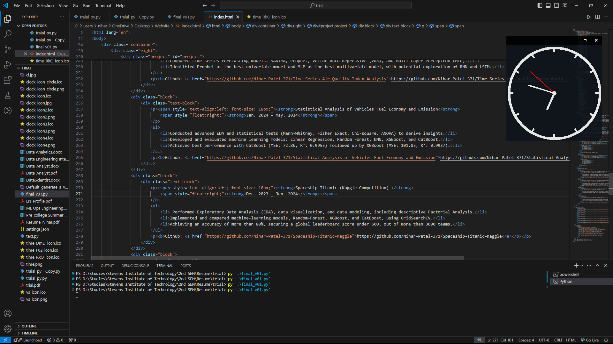

# On-screen-Clock

Customizable on-screen widget that displays the time in an analog and digital format. Perfect for keeping track of time without disrupting your workflow.

<!---->

## Table of Contents

1. [Purpose](#purpose)
2. [Features](#features)
3. [Installation](#installation)
4. [Customization](#customization)
5. [Screenshots](#screenshots)
6. [Contribution and Issues](#contribution-and-issues)
7. [License](#license)
8. [Donate](#donate)
9. [Contact](#contact)

## Purpose

The Clock Widget is designed to help users keep track of time more effectively while working on their personal computers. Unlike the default system clock, this widget is customizable and can be positioned anywhere on the screen, making it more visible and convenient.

## Features

- Display time in analog or digital format
- Customizable font, size, style, and opacity
- Always-on-top feature to keep the clock visible
- Minimalistic and user-friendly design

## Installation

To install the Clock Widget, follow these steps:

1. Download the folder `On-screen Clock Widget` from the [On-screen Clock Widget](https://github.com/Nihar-Patel-371/On-screen-Clock-Widget).
2. Run the downloaded `On-screen Clock Widget.exe` file present in the `On-screen Clock Widget` folder.

## Customization

The Clock Widget allows various customizations:

- Font: Choose your preferred font from the settings menu.
- Size: Adjust the size of the clock to fit your screen.
- Style: Select different styles for the clock display.
- Opacity: Set the opacity level for better visibility.

*Digital & Analog Customization Window* 

  
  

## Screenshots

  
  
  
  
  

## Contribution and Issues

Contributions are welcomed from the community! To contribute:

It will be a great help to me, if you can list the issues and bugs faced while using, or features which you would like to have in the program in the upcoming update.

## License
This project is licensed under the Apache-2.0 License.

## Donate

Help and support to maintain the development of the software

## Contact
For any questions or suggestions, feel free to contact me at:

- Email: niharjpatel372001@gmail.com
- LinkedIn: [niharpatel371](https://www.linkedin.com/in/niharpatel371/)
- GitHub: [Nihar-Patel-371](https://github.com/Nihar-Patel-371)
